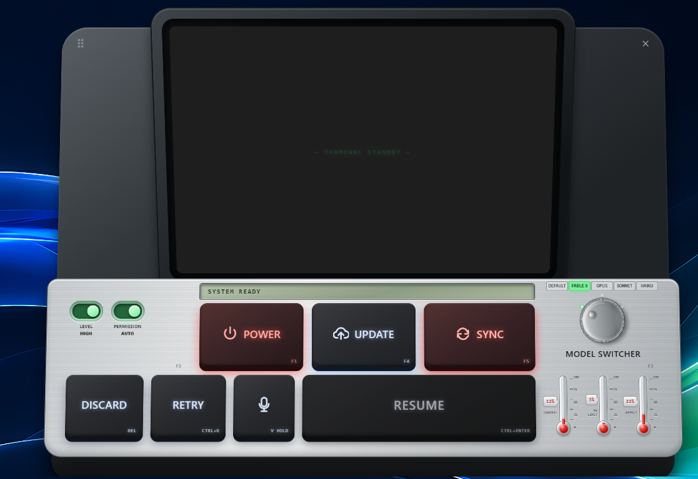
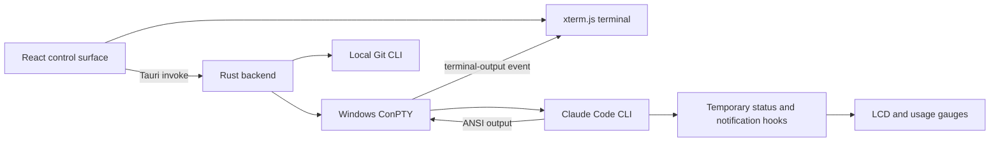

<h1 align="center">ClaudeDeck</h1>

<p align="center"><strong>A tactile Windows control surface for Claude Code.</strong></p>

<p align="center">
  Run Claude Code in a real embedded terminal, switch projects, models, permissions, and display modes, resume previous sessions, and monitor context limits from a focused hardware-inspired desktop interface.
</p>

<p align="center">
  <a href="https://github.com/palamut62/claude_control/releases">Releases</a> ·
  <a href="#getting-started">Getting Started</a> ·
  <a href="#keyboard-shortcuts">Keyboard Shortcuts</a> ·
  <a href="ClaudeDeck_Desktop_PRD.md">Product Specification</a>
</p>

<p align="center">
  
  
  
  
  
  
</p>



## Table of Contents

- [Why ClaudeDeck?](#why-claudedeck)
- [Features](#features)
- [Control Surface](#control-surface)
- [Tech Stack](#tech-stack)
- [Architecture](#architecture)
- [Project Structure](#project-structure)
- [Getting Started](#getting-started)
- [Configuration](#configuration)
- [Usage](#usage)
- [Keyboard Shortcuts](#keyboard-shortcuts)
- [Development and Testing](#development-and-testing)
- [Building for Windows](#building-for-windows)
- [Security](#security)
- [Roadmap](#roadmap)
- [Contributing](#contributing)
- [FAQ](#faq)
- [License](#license)
- [Acknowledgments](#acknowledgments)

## Why ClaudeDeck?

Claude Code is powerful, but its most common controls are spread across commands, slash commands, flags, and terminal state. ClaudeDeck brings those controls into one compact Windows application without replacing the Claude Code CLI.

It is designed for developers who want:

- a dedicated Claude Code workspace instead of another generic terminal window;
- visible model, effort, permission, and session controls;
- an embedded terminal that preserves Claude Code's native ANSI colors and interactive TUI;
- live context, five-hour, and weekly usage indicators;
- fast keyboard-driven operation with physical-control feedback;
- a safer way to inspect and restore tracked Git changes.

## Features

### Native Claude Code terminal

- Runs the locally installed Claude Code CLI inside a Windows ConPTY session.
- Renders the interactive CLI with xterm.js, true color, Unicode 11, and terminal reflow.
- Keeps PTY dimensions synchronized with the visible terminal.
- Accepts normal keyboard input and dropped files.
- Inserts the full absolute path when a file is dropped onto the terminal.

### Live session controls

- **POWER** starts or stops Claude Code in the selected project.
- Session controls remain physically and functionally disabled while POWER is off, preventing accidental configuration or terminal actions.
- **RESUME** opens Claude Code's session picker and cycles through previous conversations.
- **RETRY** repeats the previous terminal entry.
- **UPDATE** runs the official Claude Code update command.
- **SYNC** refreshes context and rate-limit usage data.
- **PROJECT** opens the Windows folder picker, changes the active working path, and restarts Claude Code in the selected folder.

### Model, effort, and permissions

- Reads model aliases supported by the installed Claude Code CLI.
- Switches models before startup or immediately in an active session.
- Includes the `FABLE 5` interface option while sending the supported `fable` CLI alias.
- Toggles between LOW and HIGH effort profiles.
- Supports ASK and AUTO permission modes.

> [!CAUTION]
> AUTO permission mode starts Claude Code with `--dangerously-skip-permissions`. Use it only in projects and environments you trust.

### Usage and notifications

- Displays context-window usage.
- Displays five-hour and seven-day rate-limit usage.
- Captures Claude Code notifications through a temporary local hook.
- Shows application, update, model, power, and synchronization messages on the calculator-style LCD.
- Animates the status LCD while startup, shutdown, updates, synchronization, retries, resumes, and project changes are in progress.

### Desktop-focused interaction

- Hardware-inspired brushed-metal interface.
- NORMAL and calculator-style LCD terminal display modes with a persistent hardware toggle.
- Rotary model selector with pointer drag, click, mouse-wheel, and keyboard input.
- Visual states for active, busy, successful, stopped, and failed operations.
- Optional speech recognition through the Windows WebView browser API.
- Single-instance behavior: launching ClaudeDeck again focuses the existing window.

### Git-aware recovery

- Inspects the selected repository with `git status --porcelain`.
- Shows tracked and untracked changes before restoration.
- Restores only explicitly selected tracked files.
- Rejects absolute or parent-traversal paths before invoking Git.

## Control Surface

| Control | Purpose | Behavior |
| --- | --- | --- |
| POWER | Start or stop Claude Code | Reflects OFF, STARTING, ON, STOPPING, and error states |
| LEVEL | Change effort | Sends LOW or HIGH to Claude Code |
| PERMISSION | Change approval behavior | ASK uses normal permissions; AUTO enables full bypass mode |
| DISPLAY | Change terminal appearance | Switches between NORMAL and calculator-style LCD modes |
| MODEL SWITCHER | Select a Claude model | Supports click, drag, wheel, F3, and Shift+F3 |
| UPDATE | Update Claude Code | Runs `claude update` using the detected CLI installation |
| SYNC | Refresh usage | Reads current context and rate-limit values |
| DISCARD | Review and restore changes | Uses Git and does not delete untracked files |
| RETRY | Repeat the previous entry | Sends Arrow Up and Enter to the active terminal |
| Microphone | Voice input | Uses Web Speech recognition when the WebView supports it |
| PROJECT | Change the working path | Opens the Windows folder picker, then restarts Claude Code in the selected folder |
| RESUME | Continue previous work | Opens `/resume`, cycles selections, and continues sessions |

Except for POWER and the window close control, session and configuration controls are disabled while Claude Code is off.

## Tech Stack

| Layer | Technology | Responsibility |
| --- | --- | --- |
| Desktop shell | Tauri 2 | Native Windows window, IPC, packaging, single instance |
| UI | React 19 + TypeScript | Control state, interaction, terminal lifecycle, notifications |
| Styling | CSS | Hardware-inspired metal, LCD, key, knob, and gauge rendering |
| Terminal | xterm.js | ANSI terminal rendering and keyboard input |
| Terminal sizing | `@xterm/addon-fit` | Fits terminal cells to the display housing |
| Unicode | `@xterm/addon-unicode11` | Modern glyph width and Unicode behavior |
| Native backend | Rust | CLI discovery, PTY ownership, process lifecycle, Git operations |
| PTY | `portable-pty` | Interactive Claude Code ConPTY session |
| Build tooling | Vite 7 | Frontend development and production builds |

## Architecture



ClaudeDeck does not proxy Claude requests or store Anthropic credentials. It launches the locally installed Claude Code CLI and communicates with it through a local pseudo-terminal.

## Project Structure

```text
claude_control/
├── docs/assets/                 # README images
├── src/
│   ├── App.tsx                 # Main interface and interaction logic
│   ├── styles.css              # Hardware-inspired visual system
│   ├── main.tsx                # React entry point
│   └── assets/                 # SVG icon sprite and app artwork
├── src-tauri/
│   ├── src/lib.rs              # PTY, Claude CLI, usage, update, and Git commands
│   ├── src/main.rs             # Native entry point
│   ├── capabilities/           # Tauri permission declarations
│   ├── icons/                  # Application and installer icons
│   ├── Cargo.toml              # Rust dependencies and metadata
│   └── tauri.conf.json         # Window, build, and bundle configuration
├── ClaudeDeck_Desktop_PRD.md   # Original product requirements
├── package.json                # Frontend scripts and dependencies
└── vite.config.ts              # Vite configuration
```

## Getting Started

### Requirements

- Windows 10 or Windows 11
- [Claude Code CLI](https://docs.anthropic.com/en/docs/claude-code) installed and authenticated
- Node.js 20.19+ or 22.12+
- npm
- Rust 1.77.2 or newer with the MSVC toolchain
- Microsoft Edge WebView2 Runtime
- Git, required only for DISCARD/recovery features

### Install dependencies

```powershell
git clone https://github.com/palamut62/claude_control.git
cd claude_control
npm install
```

Confirm that Claude Code and the build toolchain are available:

```powershell
claude --version
node --version
rustc --version
git --version
```

### Run in development

```powershell
npm run tauri dev
```

The Tauri window starts the Vite development server automatically on `http://localhost:1420`.

## Configuration

ClaudeDeck currently requires no `.env` file and no API key of its own.

| Setting | Storage | Notes |
| --- | --- | --- |
| Selected project | Browser local storage | Full local folder path |
| Selected model | Browser local storage | Restored on launch |
| Effort level | Browser local storage | LOW or HIGH |
| Permission mode | Browser local storage | ASK or AUTO |
| Display mode | Browser local storage | NORMAL or LCD |
| Usage snapshot | Browser local storage | Refreshed from Claude Code status data |

During a Claude session, ClaudeDeck creates temporary helper files under the Windows temporary directory to capture Claude Code status-line usage and notification hooks. These files contain local runtime state and are not committed to the repository.

## Usage

1. Launch ClaudeDeck.
2. Press **POWER** or `F1`.
3. If no project is configured, select its folder in the Windows folder picker.
4. Choose the desired model with the rotary selector.
5. Set LOW/HIGH effort and ASK/AUTO permissions.
6. Work directly in the embedded Claude Code terminal.
7. Drop a file onto the terminal to insert its absolute path.
8. Press **SYNC** to refresh usage gauges.
9. Press **RESUME** to browse and continue earlier Claude Code sessions.
10. Press **PROJECT** to choose another folder from the PC; ClaudeDeck restarts Claude Code in that project automatically.
11. Use the **DISPLAY** toggle to switch between the standard terminal and calculator-style LCD presentation.

## Keyboard Shortcuts

| Shortcut | Action |
| --- | --- |
| `F1` | Start or stop Claude Code |
| `F2` | Toggle LOW/HIGH effort |
| `F3` | Select the next model |
| `Shift+F3` | Select the previous model |
| `F4` | Check for Claude Code updates |
| `F5` | Refresh usage metrics |
| `Ctrl+Enter` | Open or advance the resume-session picker |
| `Ctrl+R` | Retry the previous terminal entry |
| `Enter` / `Escape` | Confirm or close the resume picker |

## Development and Testing

Build the React frontend:

```powershell
npm run build
```

Check the Rust backend:

```powershell
cargo check --manifest-path src-tauri\Cargo.toml
```

Run a complete release compile without producing installers:

```powershell
npm run tauri build -- --no-bundle
```

There is not yet an automated unit or end-to-end test suite. Before submitting a change, run both the frontend build and Rust check, then manually verify the affected interaction in the Tauri application.

## Building for Windows

Create the configured Windows bundles:

```powershell
npm run tauri build
```

Artifacts are written below:

```text
src-tauri/target/release/
src-tauri/target/release/bundle/
```

Unsigned local builds may trigger Windows SmartScreen. Production distribution should use code signing and publish checksums alongside release artifacts.

## Security

- ClaudeDeck executes the locally installed `claude` and `git` commands.
- The application does not collect Anthropic credentials.
- AUTO permission mode intentionally grants Claude Code full bypass permissions.
- DISCARD restores tracked files through Git; untracked files are listed but not deleted.
- Do not run untrusted projects with AUTO permission mode enabled.

To report a vulnerability, open a private GitHub security advisory for this repository. Do not include credentials, private source code, or sensitive terminal output in a public issue.

## Roadmap

- [ ] Add automated React and Rust tests.
- [ ] Add signed Windows installers and release checksums.
- [ ] Add an in-app project browser and recent-project list.
- [ ] Improve accessibility and high-DPI validation.
- [ ] Add configurable keyboard shortcuts.
- [ ] Add richer session history and search.
- [ ] Add optional local speech-to-text fallback.
- [ ] Add multiple concurrent Claude Code sessions.

See [ClaudeDeck_Desktop_PRD.md](ClaudeDeck_Desktop_PRD.md) for the broader product vision. The PRD includes exploratory ideas and is not a promise that every item is currently implemented.

## Contributing

1. Fork the repository.
2. Create a focused branch: `git switch -c feature/short-description`.
3. Install dependencies with `npm install`.
4. Make the smallest coherent change.
5. Run `npm run build` and `cargo check --manifest-path src-tauri\Cargo.toml`.
6. Open a pull request describing the behavior change and validation performed.

Keep UI changes consistent with the hardware-inspired visual language. Preserve native terminal behavior and avoid replacing PTY-backed interactions with simulated output.

## FAQ

<details>
<summary><strong>Does ClaudeDeck include Claude Code?</strong></summary>

No. Install and authenticate the official Claude Code CLI separately. ClaudeDeck detects the local executable at runtime.
</details>

<details>
<summary><strong>Does it work on macOS or Linux?</strong></summary>

Not currently. The backend uses Windows process discovery, PowerShell helpers, and ConPTY behavior.
</details>

<details>
<summary><strong>Why does AUTO permission mode need a warning?</strong></summary>

AUTO maps to Claude Code's `--dangerously-skip-permissions` flag. This is useful for trusted autonomous workflows but removes interactive permission prompts.
</details>

<details>
<summary><strong>Why are usage gauges empty after startup?</strong></summary>

Claude Code emits usage data after a session begins and status information becomes available. Start a session, receive a Claude response, then press SYNC.
</details>

<details>
<summary><strong>Why is voice input unavailable?</strong></summary>

Voice input depends on speech-recognition support in the installed Windows WebView runtime. It is disabled gracefully when the API is unavailable.
</details>

## License

ClaudeDeck is available under the [MIT License](LICENSE).

## Acknowledgments

- [Anthropic Claude Code](https://docs.anthropic.com/en/docs/claude-code) for the underlying CLI experience.
- [Tauri](https://tauri.app/) for the native desktop runtime.
- [xterm.js](https://xtermjs.org/) for terminal rendering.
- [portable-pty](https://crates.io/crates/portable-pty) for pseudo-terminal integration.
